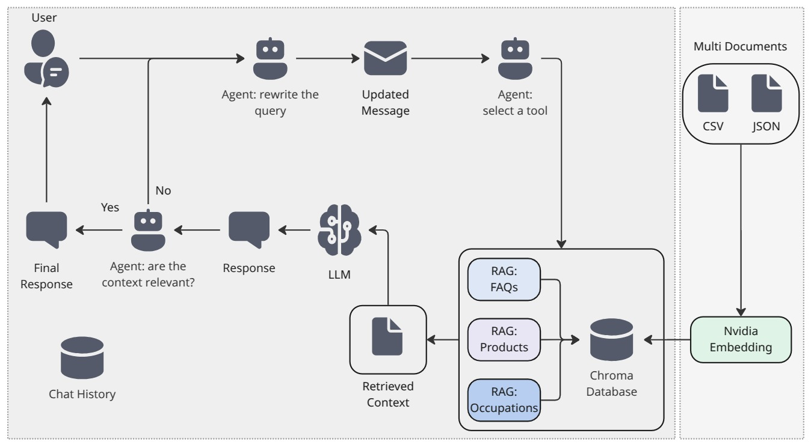

# Chatbot example with Agent RAG for an insurance company

This chatbot is built using an Agentic RAG approach and FastAPI. It leverages the Mixtral-8x7B model with Chroma database and incorporates three tools corresponding to different RAG implementations: FAQ queries, product details queries, and occupation-based insurance product queries.

\* The Mixtral-8x7B model is free to run. You may improve the overal performance of the agent using a more powerful LLM such as GPT 3.5 or later.

<table>
  <tr>
    <td>
      <p>Diagram</p>
      
    </td>
    <td>
      <p>Sample run demo</p>
      
    </td>
  </tr>
</table>


## Features

- Interactive chat interface
- Agentic RAG
- Web-based UI using FastAPI and Jinja2 templates
- Chroma DB


## Prerequisites

- Python 3.11+
- FastAPI
- LangChain
- LangSmith API key
- NVIDIA AI API key
- Uvicorn


## Project Structor
```bash
project_root/
│
├── assets/
│   ├── chat_screen.webm
│   └── diagram.jpg   
│     
├── data/
│   ├── raw:JSON, CSV
│   └── vector: ChormaDB
│
├── src/
│   ├── __init__.py
│   ├── agent.py
│   ├── config.py
│   ├── data_classes.py
│   ├── db_creator.py
│   ├── rags.py
│   ├── utils.py
│   └── templates/
│       └── indexes.html
│── tests/
│   ├── __init__.py
│   └── test_rag.py      
│
├── README.md
├── Dockerfile
└── requirements.txt
```


## Installation

### To locally run the agent use the following steps

1. Clone the repository:
```bash
git clone https://github.com/YJonmo/agentic_rag.git
cd agentic_rag
```

2. Create a virtual env:
```bash
python -m venv .venv
source .venv/bin/activate
pip install -r requirements.txt
```

3. Get an API key from [Nvidia website](https://build.nvidia.com/mistralai/mixtral-8x7b-instruct?snippet_tab=Python&signin=true&api_key=true) and an API key for [LangSmith](https://docs.smith.langchain.com/administration/how_to_guides/organization_management/create_account_api_key) and place them in your .env file using the following commands:
```bash
echo NVIDIA_API_KEY="your-nvidia-api-key" >> .env
echo LANGSMITH_API_KEY="your-langsmith-key" >> .env
```

4. Run the following file to create a vector DB from the JSON and the CSV files in the data/raw folde:
```bash
python src/db_creator.py
```

5. Test the vector DB:
```bash
pytest
```
If there was not error then the vector DB is created inside the ```.data/vector``` folder.


6. Run the agent locally:
```bash
uvicorn src.agent:app --host 0.0.0.0 --port 8000 --reload
```

7. Open a web browser at:
```bash
http://0.0.0.0:8000/
```

### You could build the docker image and deploy either locally or in the cloud

1. Build the docker image:
```bash
docker build -t agentic_rag .
```

2. Run the docker image:
```bash
docker run -e NVIDIA_API_KEY="your-nvidia-api-key" -p 8000:8000 agentic_rag
```
